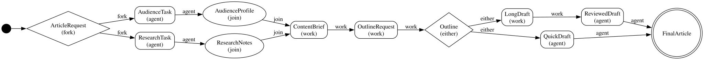

# Pravah

[](https://crates.io/crates/pravah)
[](https://docs.rs/pravah)
[](LICENSE-MIT)

_Pravah_ (प्रवाह, _pruh-VAH_) — Sanskrit/Hindi for "flow" or "current".

A Rust library for building typed, stepwise agentic information flows.

Pravah is not a general workflow engine. A flow is a single-threaded graph that
moves information from one typed node to the next. Each call to `next()` does
one bounded unit of work: one LLM turn, one tool batch, one deterministic
transform, one branch, one fork, or one join. The caller decides when to
persist state and how to resume it.

## Installation

```toml
[dependencies]
pravah = "0.1"
```

### Features

| Feature              | Default | Description                                                                                                                   |
| -------------------- | :-----: | ----------------------------------------------------------------------------------------------------------------------------- |
| `provider-openai`    |    ✓    | OpenAI-compatible API client                                                                                                  |
| `provider-anthropic` |    ✓    | Anthropic Claude API client                                                                                                   |
| `provider-gemini`    |    ✓    | Google Gemini API client                                                                                                      |
| `provider-ollama`    |    ✓    | Ollama local model client                                                                                                     |
| `provider-genai`     |    —    | Extra providers via the [`genai`](https://crates.io/crates/genai) crate                                                       |
| `diagram-text`       |    —    | Render flow graphs as Unicode box-drawing text in the terminal (adds [`mermaid-text`](https://crates.io/crates/mermaid-text)) |

To use only specific providers, disable defaults:

```toml
pravah = { version = "0.1", default-features = false, features = ["provider-openai"] }
```

## Getting Started

This minimal example defines a two-node flow: an agent that produces bullet
points from a request, and a work node that assembles them into a final report.

```rust
use pravah::flows::{Agent, Flow, FlowError, FlowGraph, FlowRuntime, RunOut};
use pravah::context::{Context, FlowConf};
use pravah::tools::ToolBox;
use schemars::JsonSchema;
use serde::{Deserialize, Serialize};

// ── Types ──────────────────────────────────────────────────────────────────

#[derive(Serialize, Deserialize, JsonSchema)]
struct SummariseRequest { topic: String }

#[derive(Serialize, Deserialize, JsonSchema)]
struct BulletPoints { points: Vec<String> }

#[derive(Serialize, Deserialize, JsonSchema)]
struct Report { text: String }

// ── Agent ──────────────────────────────────────────────────────────────────

impl Agent for SummariseRequest {
    type Output = BulletPoints;

    fn preamble() -> String { "Summarise the topic as concise bullet points.".into() }
    fn model_url() -> String { "openai://gpt-4o-mini".into() }
    fn tool_box() -> ToolBox { ToolBox::builder().build() }
}

// ── Work node ─────────────────────────────────────────────────────────────

async fn format_report(points: BulletPoints, _ctx: Context) -> Result<Report, FlowError> {
    let text = points.points.iter().map(|p| format!("• {p}")).collect::<Vec<_>>().join("\n");
    Ok(Report { text })
}

// ── Flow ───────────────────────────────────────────────────────────────────

impl Flow for SummariseRequest {
    type Output = Report;

    fn build() -> Result<FlowGraph, FlowError> {
        FlowGraph::builder()
            .agent::<SummariseRequest>()
            .work(format_report)
            .build()
    }
}

// ── Run ────────────────────────────────────────────────────────────────────

#[tokio::main]
async fn main() -> anyhow::Result<()> {
    let ctx = Context::new(FlowConf::default());
    let input = SummariseRequest { topic: "Rust ownership model".into() };
    let mut runtime = FlowRuntime::new(input)?;

    loop {
        match runtime.next(ctx.clone()).await? {
            RunOut::Continue => {}
            RunOut::Done(report) => { println!("{}", report.text); break; }
            RunOut::Suspend { .. } => unreachable!("no suspension tools registered"),
        }
    }
    Ok(())
}
```

See the [`examples/`](examples/) directory for runnable examples covering
linear flows, fork/join, nested flows, and snapshot-based resumption.

## The Core Idea

**Within a single flow graph, each input type identifies exactly one node.**

`PlanInput` can be the input for one agent node, one work node, one branch
node, one fork node, or one join participant — never more than one. The builder
rejects duplicates. When a value of type `PlanInput` is present in flow state,
there is exactly one node that can consume it. This keeps routing unambiguous
and state checkpointable between steps.

## Node Types

| Builder method           | What it does                                    |
| ------------------------ | ----------------------------------------------- |
| `agent::<A>()`           | LLM-backed node; structured output or tool loop |
| `work::<From, Out>()`    | Deterministic async transform                   |
| `either::<From, A, B>()` | Routes to one of two typed branches             |
| `fork::<From, A, B>()`   | Splits one value into two active branches       |
| `join::<A, B, Out>()`    | Combines two branches once both are ready       |

Fork and join model information shape, not parallelism. A single-threaded
runner represents non-linear graphs where information splits and recombines.

## Why Types Matter

Pravah uses Rust types as the contract at every boundary: agent input structs
define the first user message shape, output types define the result schema,
tool structs define LLM-callable arguments, and all handlers receive typed
values. State is stored as JSON internally so it can be serialized, but user
code stays typed.

## Agents

```rust
use schemars::JsonSchema;
use serde::{Deserialize, Serialize};
use pravah::flows::Agent;
use pravah::tools::ToolBox;

#[derive(Serialize, Deserialize, JsonSchema)]
struct PlannerInput { goal: String }

#[derive(Serialize, Deserialize, JsonSchema)]
struct Plan { steps: Vec<String> }

impl Agent for PlannerInput {
    type Output = Plan;

    fn preamble() -> String { "You are a careful planning agent.".into() }
    fn model_url() -> String { "gemini://gemini-2.5-flash-lite".into() }
    fn tool_box() -> ToolBox { ToolBox::builder().build() }
}
```

With no tools, Pravah uses structured-output mode. With tools, it injects a
typed exit sentinel so the model can submit the final value.

## Tools

```rust
use schemars::JsonSchema;
use serde::{Deserialize, Serialize};
use pravah::context::Context;
use pravah::tools::{Tool, ToolError};

#[derive(Deserialize, JsonSchema)]
struct ReadNote { path: String }

#[derive(Serialize)]
struct ReadNoteOutput { content: String }

impl Tool for ReadNote {
    type Output = ReadNoteOutput;
    fn name() -> &'static str { "read_note" }
    fn description() -> &'static str { "Read a note from the working directory." }

    async fn call(self, ctx: Context) -> Result<Self::Output, ToolError> {
        let content = tokio::fs::read_to_string(ctx.resolve(&self.path)?).await?;
        Ok(ReadNoteOutput { content })
    }
}
```

`Context` carries the working directory, command allowlist, dependency
container, and shared HTTP client.

## Building A Flow

```rust
use pravah::flows::{Flow, FlowError, FlowGraph};

async fn plan_to_answer(plan: Plan, _ctx: Context) -> Result<FinalAnswer, FlowError> {
    Ok(FinalAnswer { text: plan.steps.join("\n") })
}

#[derive(Serialize, Deserialize, JsonSchema)]
struct FinalAnswer { text: String }

impl Flow for PlannerInput {
    type Output = FinalAnswer;

    fn build() -> Result<FlowGraph, FlowError> {
        FlowGraph::builder()
            .agent::<PlannerInput>()
            .work(plan_to_answer)
            .build()
    }
}
```

The builder validates: duplicate node identities, entry not in graph,
unreachable nodes, no path to a terminal value, invalid fork/join definitions,
and both branches of an either routing to the same type.

## Running A Flow

```rust
use pravah::context::{Context, FlowConf};
use pravah::flows::{FlowRuntime, RunOut};

let ctx = Context::new(FlowConf { working_dir: Some(std::env::current_dir()?), ..Default::default() });
let mut runtime = FlowRuntime::new(PlannerInput { goal: "Write a migration plan".into() })?;

loop {
    match runtime.next(ctx.clone()).await? {
        RunOut::Continue => {}
        RunOut::Suspend { value, tool_id } => {
            // Persist state, collect external input, then:
            runtime.resume(ctx.clone(), (tool_id, json!({ "approved": true }))).await?;
        }
        RunOut::Done(output) => { println!("{}", output.text); break; }
    }
}
```

## Suspend And Resume

A tool returns `ToolError::suspend(value)` to pause the flow. The runtime
surfaces a suspension payload and a tool id. The caller can persist state,
show the request to a user, wait for a webhook — then call `resume()` with the
matching tool id and a JSON response. Useful for approval gates, missing
credentials, payments, or any action needing external confirmation.

## Persistence

Call `runtime.snapshot()` to capture an opaque `FlowSnapshot`
(serializable, no closures). Restore it with `FlowRuntime::from_snapshot(snap)`.
Conversation history is managed separately — re-attach it with
`runtime.with_history(history)` after restoring. Pravah defines the
serializable state; it does not prescribe where snapshots live.

## Nested Flows

A flow has the same shape as a node: typed input, stepwise execution, typed
output. Use nested flows to keep large agent systems modular — a planning flow
can contain a research sub-flow, a coding flow can contain a review-and-fix
sub-flow. The same node-identity rule applies at each graph boundary.

### Example: Article Production Pipeline

Combines every node type — fork, join, work, either, agent, and two nested flows.
The tree below is the output of `FlowGraphDiagram::for_flow::<ArticleRequest>()?.render_tree()`:

```text
● ArticleRequest (fork)
  ├── [fork] AudienceTask (agent)
  │   └── [agent] AudienceProfile (join)
  │       └── [join] ContentBrief (work)
  │           └── [work] OutlineRequest (work)
  │               └── [work] Outline (either)
  │                   ├── [either] LongDraft (work)
  │                   │   └── [work] ReviewedDraft (agent)
  │                   │       └── [agent] FinalArticle ◉
  │                   └── [either] QuickDraft (agent)
  │                       └── [agent] FinalArticle ◉ ↩
  └── [fork] ResearchTask (agent)
      └── [agent] ResearchNotes (join)
          └── [join] ContentBrief (work) ↩
```

`↩` marks nodes that converge from multiple branches (already shown above).



## Clients

Provider-agnostic by default. Model URLs select the backend:

- `gemini://gemini-2.5-flash-lite`
- `openai://gpt-4o`
- `anthropic://claude-sonnet-4-5`
- `ollama://localhost:11434/qwen3:8b`

Default features include OpenAI, Anthropic, Gemini, and Ollama. An optional
`provider-genai` feature adds an experimental adapter for extra providers.
Inject a custom `ClientFactory` for testing, recording/replay, or hosted
gateways.

## When To Use Pravah

**Use it** when you want agentic flows that are type-directed, inspectable,
resumable, testable with fake clients, and explicit about information movement.

**Don't use it** as a distributed workflow engine, parallel job scheduler,
queue processor, or durable storage system. Pravah can sit inside those
systems but does not try to replace them.
